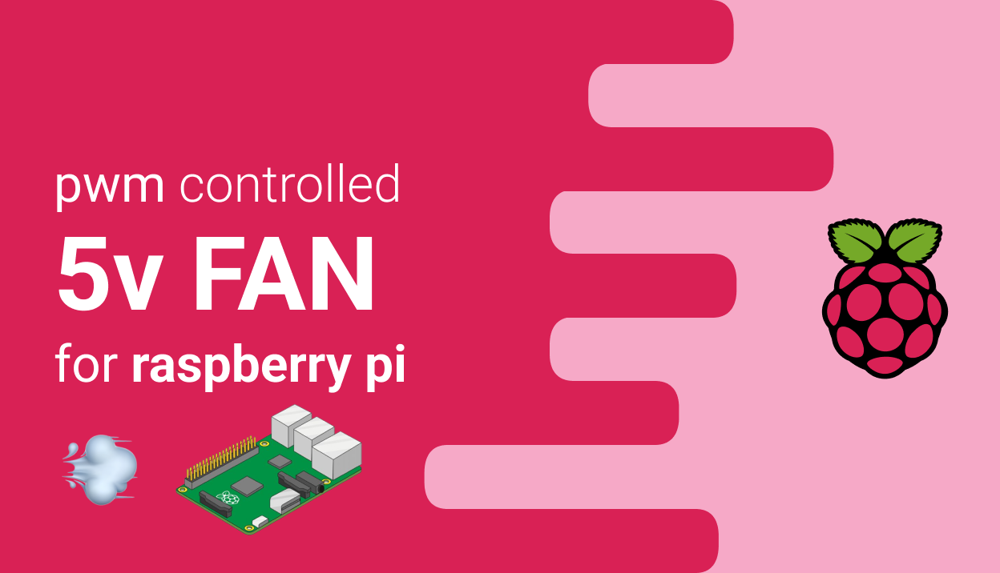
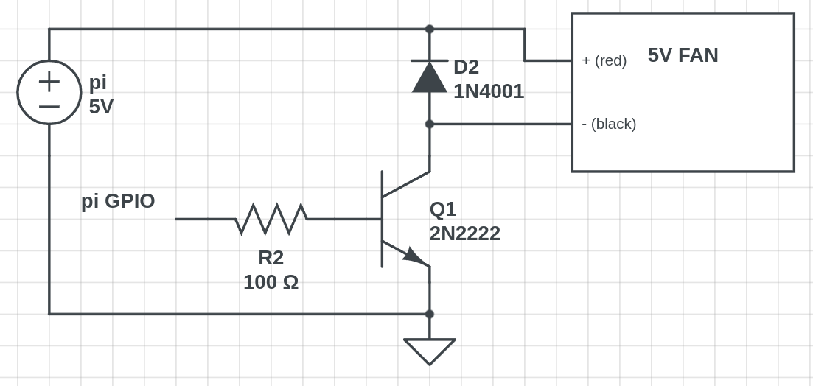
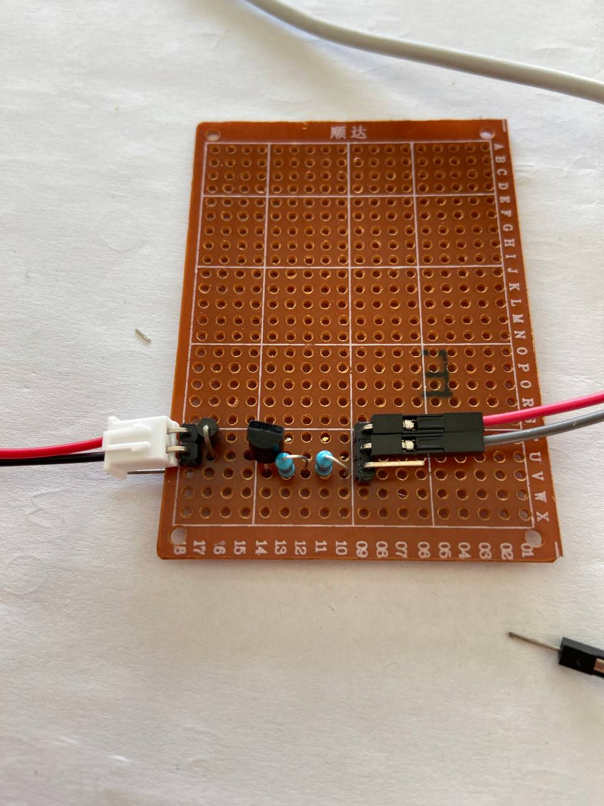
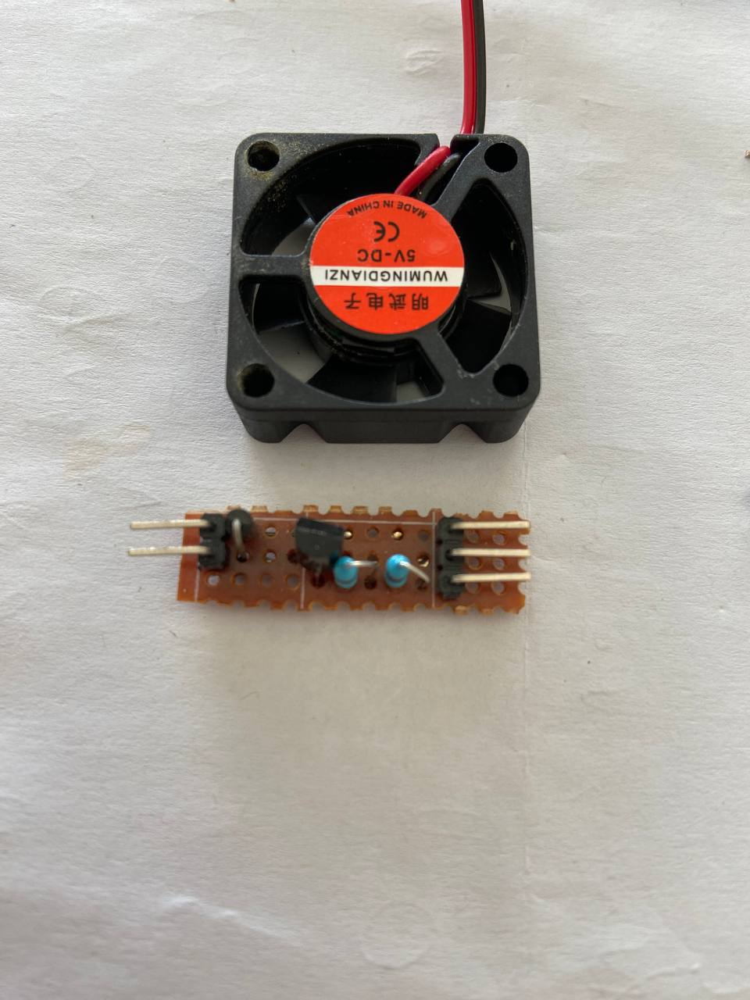
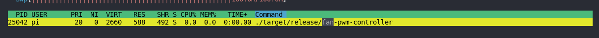

# PI - FAN



PWD controller fan, turning on only when a certain temperature is reached.

You can always check your pi pinouts by going [here](https://pinout.xyz/)

## Schematics

### Parts

- 5V fan
- one diode, in my case `1n4001`
- one bjt transistor, in my case `2n2222`
- `1k` ohm resistor, in my case two `470` ohm resistors

The schematic below shows the circuit.


*made with https://www.circuitlab.com/*
**R2 should be 1k ohm**

## Build

I've used a perfboard to create the circuit. Here the results



The final result is very small!



A little test to ensure everything is working :) 


## Software

I've used [rust](https://www.rust-lang.org/tools/install), since it's faster and more efficient than python.

### Installation

To install rust

```
curl --proto '=https' --tlsv1.2 -sSf https://sh.rustup.rs | sh
```

### Code

Code can be found inside `./code`, the cargo project is called `fan-controller`.

The whole code is short, variables can be changed on top. The fan will be triggered when the temperature is `> 60C`.

```rust
use sysfs_gpio::{Direction, Pin};
use std::thread::sleep;
use std::time::Duration;
use std::{fs, num::ParseIntError, fmt::Error};

const TEMP_FILE_PATH: &str = "/sys/class/thermal/thermal_zone0/temp";
const TRIGGER_TEMP_IN_CELSIUS: i32 = 60;
const TIME_WAIT_IN_MILLISECONDS: u64 = 2 * 1000;
const GPIO: u64 = 17;

fn get_temperature(file_path: &str) -> Result<i32, &str> {
    let temp = match fs::read_to_string(file_path) {
         Ok(line) =>  match line.trim().parse::<i32>() {
             Ok(temp) => Ok(temp/ 1000),
             ParseIntError => Err("Cannot parse int.")
         },
         Err(error) => Err("Cannot open file.")
     };
 
     return temp;
 }
 

fn main() {
    let my_pin = Pin::new(GPIO);
    my_pin.with_exported(|| {
        my_pin.set_direction(Direction::Out).unwrap();
        loop {
            match get_temperature(TEMP_FILE_PATH) {
                Ok(temp) => {
                    if temp < TRIGGER_TEMP_IN_CELSIUS { 
                        println!("{}", "[ON] Fan");
                        my_pin.set_value(0).unwrap();
    
                    }
                    else {
                        println!("{}", "[OFF] Fan");
                        my_pin.set_value(1).unwrap();
                
                    }
                    println!("Temperature is = {}C", temp);
                    sleep(Duration::from_millis(TIME_WAIT_IN_MILLISECONDS));
                },
                Err(error) => println!("{}", error)
            };
        }
     
    }).unwrap();
}
```

**You can build your code by running**

```
cd code && cargo build --release
```

Then you can find it inside

```
sudo chmod +x ./code/target/release/fan-controller
./code/target/release/fan-controller
```



Then, to run it at startup

```
sudo nano /etc/rc.local

```

and add the command to run the code before `exit 0`. In my case

```
sudo /home/<USER_NAME>/fan-controller/target/release/fan-controller
```


Et voila! The script will start at startup time 🥳 
